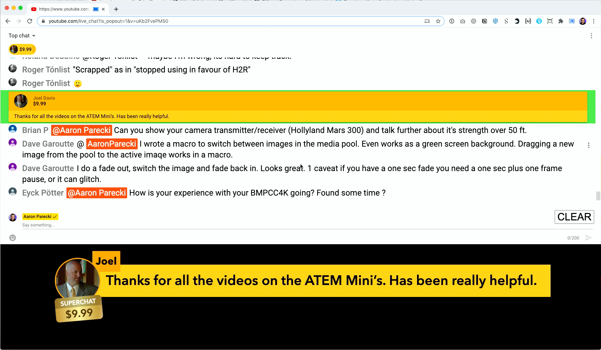
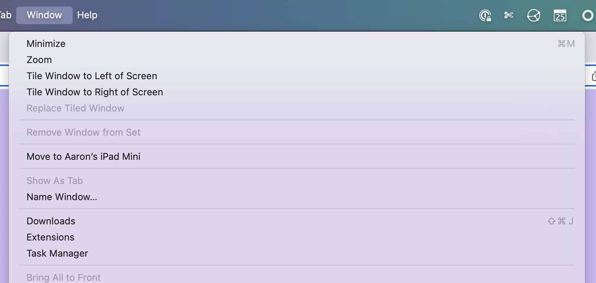
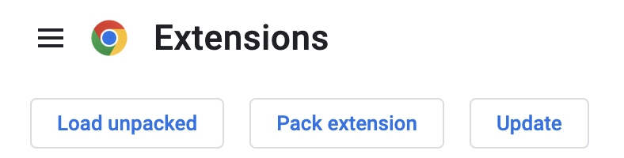

Live Chat Overlay
=================

This browser extension turns the YouTube popout chat window into something that can be used to show chat comments keyed over a video. You can also bring it in to software like OBS or Lightstream Studio as a browser source!

[Setup Tutorial](https://youtu.be/HwctGtdsHZI)

## Installation

### Google Chrome Store

The easiest way to install the extension from the Google Chrome store. Click the link below and you should see a prompt to install it in Chrome.

* https://chrome.google.com/webstore/detail/live-chat-overlay/aplaefbnohemkmngdogmbkpompjlijia

### Manual Installation

First, [download this project](https://github.com/aaronpk/live-chat-overlay/archive/refs/heads/main.zip) and unzip it somewhere on your computer. In Chrome, launch the Extensions page.

Go to **Window** and click **Extensions** (or enter this in your address bar `chrome://extensions/`)

Turn on **Developer Mode**

That will show a new set of options. Click "Load Unpacked"

Choose the folder you downloaded the extension into, and you should see it now in your list of extensions!

## Usage

Open up the YouTube live chat for a video, and click YouTube's "popout chat" button to open it in a new window. Or replace the `VIDEOID` in the URL below with your video's ID.

`https://www.youtube.com/live_chat?is_popout=1&v=VIDEOID`

### Keying from a Computer

You'll next need to bring that into your video stream and key it out, which will depend on what software or hardware you are using. In the ATEM Mini, you can use these settings in the upstream keyer:

* Luma key
* not premultiplied
* clip: 7%
* gain: 100%

Or you can use the downstream keyer:

* not premultiplied
* mask:
  * top: X
  * bottom: -9
  * left: -16
  * right: 16

### Adding as a Browser Source

In software such as [OBS](https://obsproject.com) or [Lightstream Studio](http://strea.mr/aaronparecki) you can pop out a remote window as a browser source, and remote control it from your main YouTube chat window.

Before you start, you'll want to make sure you change the background color in the extension settings to the word "transparent" so that the browser window will have a transparent background.

Once you've loaded the YouTube popout chat window described above, you will see a button in the YouTube chat window called "Get Overlay URL". Clicking that will reveal a URL you can copy and load into OBS or your favorite streaming platform that supports browser overlay sources.

You can open the URL on your computer too if you want to full screen it on a second monitor.

### Persistent Links

There is now an option for "Persistent Session ID" to enable a persistent link for your stream so that you don't have to re-add the browser source every time. Here is how to use it.

In the options form, check "Persistent Session ID" which will show a text box with a randomly generated Session ID. This Session ID will be used for all you future chats. You can also change the Session ID in that field if you want to reuse one that you already saved in a browser source.

Note: You should always use a randomly generated ID. If you use a short word like "test", then the chats will be combined with anyone else who has used the same short word.

## See this in action!

You can see this in action on many of [Aaron Parecki's livestreams](https://www.youtube.com/watch?v=CHQITWm5wDQ&list=PLRyLn6THA5wPracMVE74IHovBT3ebcsJV)!

## Running your own remote server

The extension defaults to pushing the chat messages through a server managed by [Aaron Parecki](https://aaronpk.tv), and the remote window is loaded from that website. The chat messages aren't stored on the server, and there is very little resource usage for this, but if you are more comfortable running this on your own server, head over to the [overlay remote GitHub project](https://github.com/aaronpk/live-chat-overlay-remote) for instructions.

## TODO

See https://github.com/aaronpk/youtube-chat-overlay/issues

## Credits

The original CSS and JavaScript originally came from a video by [ROJ BTS](https://www.youtube.com/watch?v=NHy9D4ClTvc), so huge thanks to him for the initial work!

