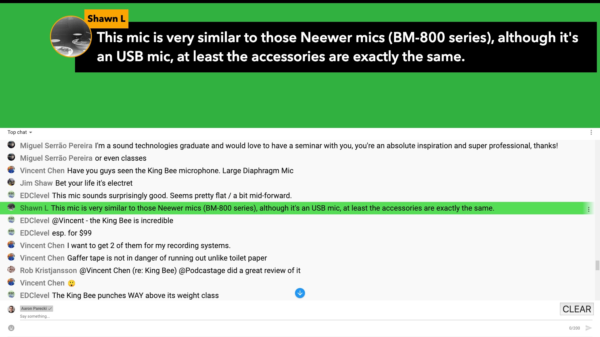

YouTube Chat Overlay
====================

This CSS and JS turns the popout YouTube chat window into something that can be used to show chat comments greenscreened onto a video.

## Installation

Install the [Styler Pro](https://chrome.google.com/webstore/detail/styler-pro/hbhkfnpodhdcaophahpkiflechaoddoi?hl=en) browser extension.

Open up the YouTube live chat, and click popout chat to open it in a new window. Or replace the `VIDEOID` in the URL below with your video's ID.

`https://www.youtube.com/live_chat?is_popout=1&v=VIDEOID`

Click the "S" icon to open the browser extension, and copy the CSS and JS from the files in this repository into the window.

Click "Run" and now you should be able to click messages from the chat and they will show up in the green space up top.

You'll next need to bring that into your video stream and key it out, which will depend on what software or hardware you are using. In the ATEM Mini, you can use these settings in the upstream keyer: 

* Luma key
* not premultiplied
* clip: 7%
* gain: 100%

Or you can use the downstream keyer:

* not premultiplied
* mask: 
  * top: X
  * bottom: -9
  * left: -16
  * right: 16

## Credits

Most of this code came from a video by [ROJ BTS](https://www.youtube.com/watch?v=NHy9D4ClTvc), so huge thanks to him for the CSS and JS!

