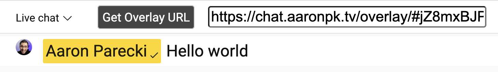

Live Chat Overlay
=================

This browser extension turns the YouTube popout chat window into something that can be used to show chat comments keyed over a video. You can also bring it in to software like OBS or Lightstream Studio as a browser source!

[Setup Tutorial](https://youtu.be/HwctGtdsHZI)

## Installation

Install from the Chrome extension store:

* https://chrome.google.com/webstore/detail/live-chat-overlay/aplaefbnohemkmngdogmbkpompjlijia

Or you can install this as an "unpacked" extension. [Download this project](https://github.com/aaronpk/live-chat-overlay/archive/refs/heads/main.zip) and unzip it somewhere on your computer. In Chrome, launch the Extensions page

* [chrome://extensions/](chrome://extensions/)

Then choose "Load unpacked", and navigate to the folder you unzipped this into.

## Usage

Open up the YouTube live chat for a video, and click YouTube's "popout chat" button to open it in a new window. Or replace the `VIDEOID` in the URL below with your video's ID.

`https://www.youtube.com/live_chat?is_popout=1&v=VIDEOID`

### Keying from a Computer

You'll next need to bring that into your video stream and key it out, which will depend on what software or hardware you are using. In the ATEM Mini, you can use these settings in the upstream keyer:

* Luma key
* not premultiplied
* clip: 7%
* gain: 100%

Or you can use the downstream keyer:

* not premultiplied
* mask:
  * top: X
  * bottom: -9
  * left: -16
  * right: 16

### Adding as a Browser Source

In software such as [OBS](https://obsproject.com) or [Lightstream Studio](http://strea.mr/aaronparecki) you can pop out a remote window as a browser source, and remote control it from your main YouTube chat window.

Before you start, you'll want to make sure you change the background color in the extension settings to the word "transparent" so that the browser window will have a transparent background.

Once you've loaded the YouTube popout chat window described above, you will see a button in the YouTube chat window called "Get Overlay URL". Clicking that will reveal a URL you can copy and load into OBS or your favorite streaming platform that supports browser overlay sources.

You can open the URL on your computer too if you want to full screen it on a second monitor.

## See this in action!

You can see this in action on many of [Aaron Parecki's livestreams](https://www.youtube.com/watch?v=CHQITWm5wDQ&list=PLRyLn6THA5wPracMVE74IHovBT3ebcsJV)!

## Running your own remote server

The extension defaults to pushing the chat messages through a server managed by [Aaron Parecki](https://aaronpk.tv), and the remote window is loaded from that website. Nothing is stored, and there is very little resource usage for this, but if you are more comfortable running this on your own server, head over to the [overlay remote GitHub project](https://github.com/aaronpk/live-chat-overlay-remote) for instructions.

## TODO

See https://github.com/aaronpk/youtube-chat-overlay/issues

## Credits

The CSS and JavaScript originally came from a video by [ROJ BTS](https://www.youtube.com/watch?v=NHy9D4ClTvc), so huge thanks to him for the initial work!

