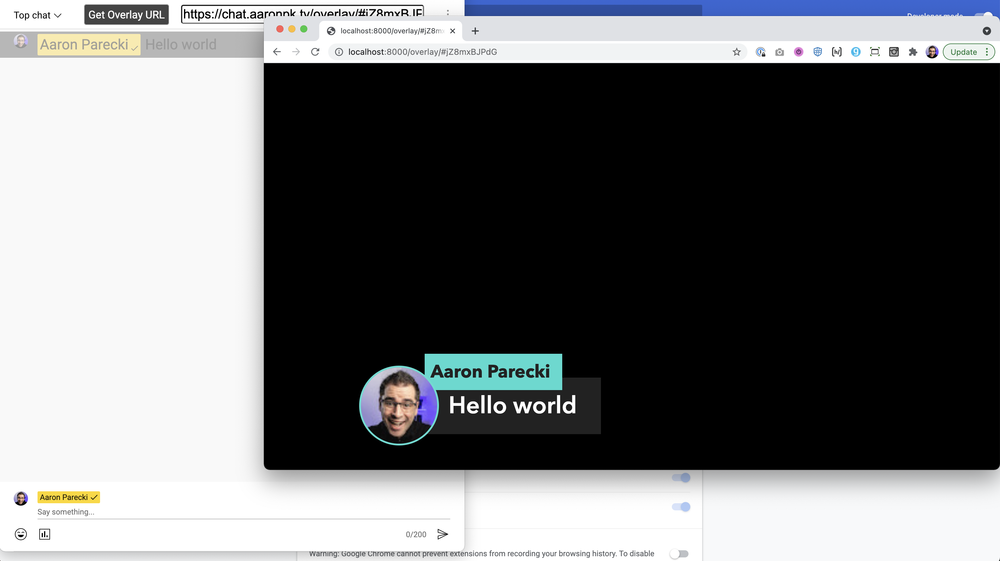

Live Chat Overlay: Zoom Editon
=================

This CSS and JS turns the popout Zoom chat window into something that can be used to show chat comments keyed over a video.

## todo: this needs updating.

[Setup Tutorial](https://youtu.be/HwctGtdsHZI)

## Installation

Install from the Chrome extension store:

* https://chrome.google.com/webstore/detail/live-chat-overlay/aplaefbnohemkmngdogmbkpompjlijia

Or you can install this as an "unpacked" extension. In Chrome, launch the Extensions page

* [chrome://extensions/](chrome://extensions/)

Then choose "Load unpacked", and navigate to this folder.

## Usage

Open up the YouTube live chat for a video, and click popout chat to open it in a new window. Or replace the `VIDEOID` in the URL below with your video's ID.

`https://www.youtube.com/live_chat?is_popout=1&v=VIDEOID`

You'll next need to bring that into your video stream and key it out, which will depend on what software or hardware you are using. In the ATEM Mini, you can use these settings in the upstream keyer:

* Luma key
* not premultiplied
* clip: 7%
* gain: 100%

Or you can use the downstream keyer:

* not premultiplied
* mask:
  * top: X
  * bottom: -9
  * left: -16
  * right: 16

## See this in action!

You can see this in action on many of [Aaron Parecki's livestreams](https://www.youtube.com/watch?v=CHQITWm5wDQ&list=PLRyLn6THA5wPracMVE74IHovBT3ebcsJV)!

## TODO

See https://github.com/aaronpk/youtube-chat-overlay/issues

## Credits

Most of this CSS and JavaScript came from a video by [ROJ BTS](https://www.youtube.com/watch?v=NHy9D4ClTvc), so huge thanks to him for the initial work!
